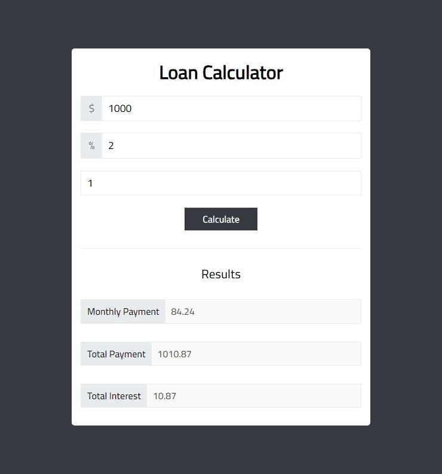

# Loan-Calculator

Loan Calculator Use To Calculate Loan Total Payment, Monthly Payment and Total Interest.

## Table of contents

- [Overview](#overview)
  - [The Loan-Calculator features](#the-Loan-Calculator-features)
  - [Screenshot](#screenshot)
  - [Links](#links)
- [My process](#my-process)
  - [Built with](#built-with)
  - [What I learned](#what-i-learned)
- [Author](#author)

## Overview

### The Loan-Calculator features

Users should be able to:

- Write the loan amount, interest, and years to repay then get the total payment, monthly payment, and total interest.
- If you forget one of the input fields then the alert will appear to warn you.

### Screenshot

- Desktop view

### Links

- Live Site URL : [Loan-Calculator](https://mahmoudsmohammed.github.io/Loan-Calculator/)

## My process

### Built with

- HTML5
- CSS3
- SASS
- JavaScript

### What I learned

- How structure the project files.
- Using Git and Github.
- Use SASS and learn how to structure my files to be easy to debug.
- SASS Placeholder and Variables which save a lot of time.
- How to Manipulate Dom With JavaScript.
- Using setTimeOut to Control of Execution.

## Author

- Linkedin - [Mahmoud Sayed](https://www.linkedin.com/in/mahmoud-sayed-b85536217/)
- Codewars - [@MahmoudsMohammed](https://www.codewars.com/users/MahmoudsMohammed)
